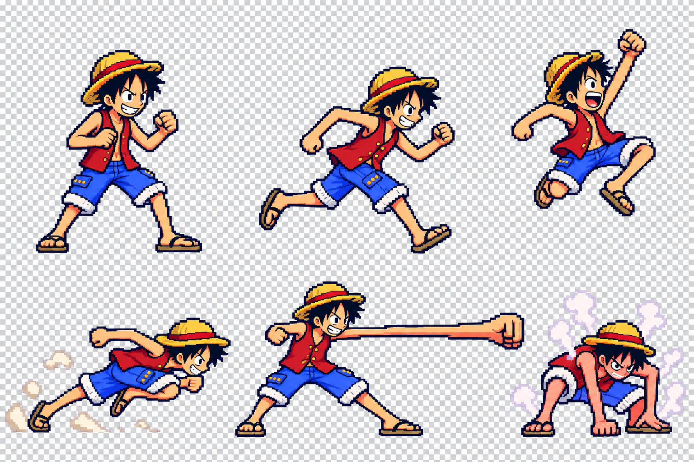
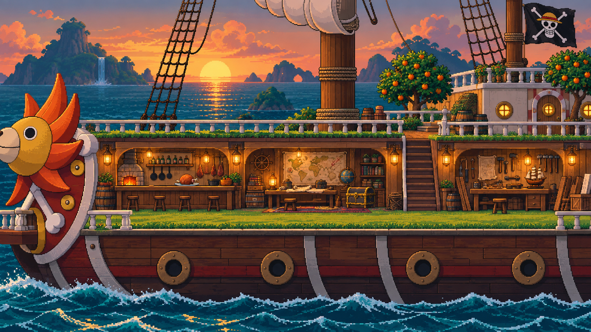
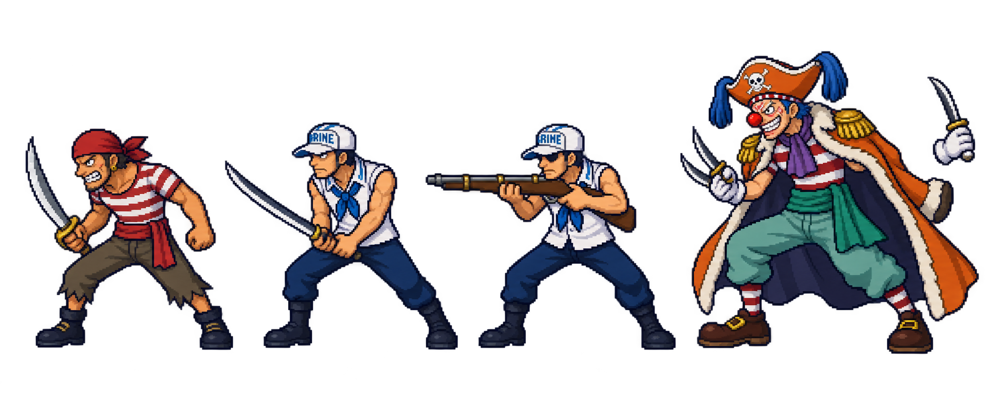
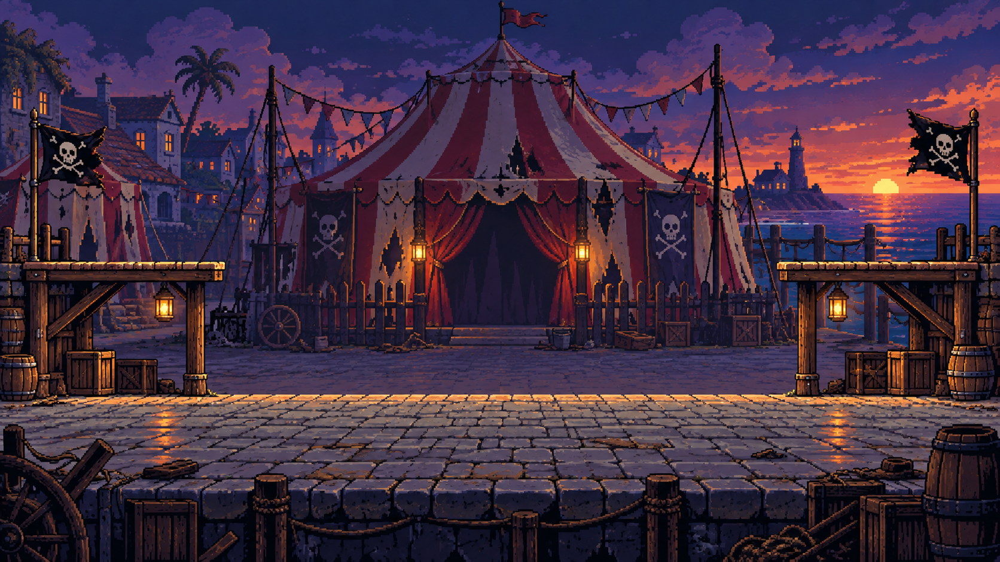

# First Voyage

A One Piece fan-game concept

A side-scrolling action platformer starring pre-timeskip Luffy: explore hostile islands, learn demanding boss fights, recover lost treasure, and return to the Thousand Sunny to prepare for the next voyage.

## Start here

- **[Play First Voyage](play/index.html)** — the playable Sunny → Orange Town → Buggy prototype, now with longer parkour routes, pursuing pirates, impact bombs and a closer camera. Open through the local server at `http://127.0.0.1:8766/play/`.
- **[Hosting notes](docs/HOSTING.md)** — putting the build on the web, what a visitor downloads, and what the four-digit gate does and does not do.
- **[Playable build notes](docs/PLAYABLE_PROTOTYPE.md)** — controls, route, saving, implemented systems and current limits.

- **[Cleanup checklist](docs/NEXT_SESSION.md)** — completed fixes for sprites, Sunny ocean, flag, and checkpoints.

- **[Chapter 01 asset pack](assets/chapter-01/README.md)** — pirate variations, 16 Buggy poses, layered stages, animated props, and health overlays.
- **[Motion preview](preview/index.html)** — review parallax, sea/flag motion, health fills, and keyframe sequences locally.
- **[Updated Chapter 01 design](docs/CHAPTER_01.md)** — pirate-only opening, Den Den Mushi checkpoints, and layer/motion rules; supersedes the original opening-chapter details below.

- [Game overview](docs/GAME_OVERVIEW.md) — combat, progression, the Sunny, enemies, and the first playable slice.
- [Production roadmap](docs/PRODUCTION_ROADMAP.md) — a practical build order and completion criteria.
- [Asset guide](assets/ASSET_GUIDE.md) — generated concepts, intended uses, and production requirements.
- [Generation prompts](assets/GENERATION_PROMPTS.md) — the exact prompts used to create the first asset pack.

The package now includes a browser-playable prototype alongside the art study and design documents. It uses the 46 cleaned and registered poses. Additional in-between drawings and gameplay polish are still needed.

## Visual direction

Warm straw-gold and red characters against cool ocean shadows; crisp pixel silhouettes; layered island environments; and a welcoming, lantern-lit Sunny. Take inspiration from Hollow Knight's readable combat, interconnected exploration, and checkpoint tension while giving Luffy an elastic, aggressive movement language.

### Luffy: movement and combat

### Thousand Sunny: the hub

### Enemy silhouettes

### Orange Town: first boss arena

